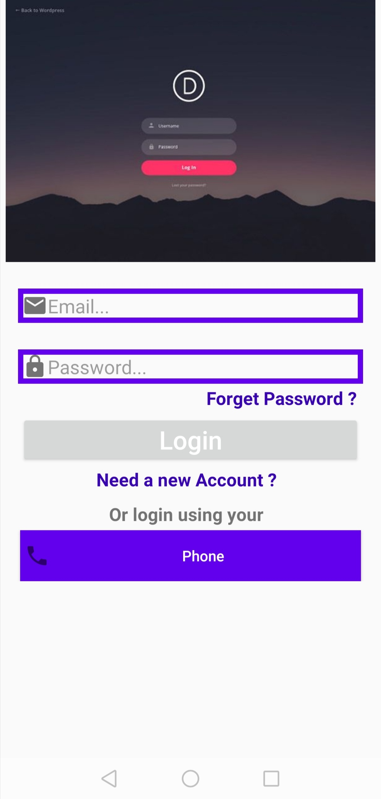
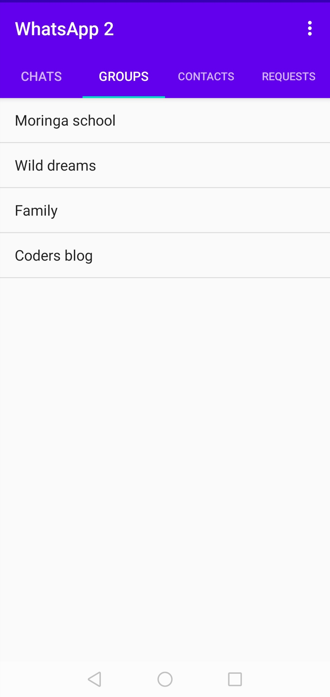
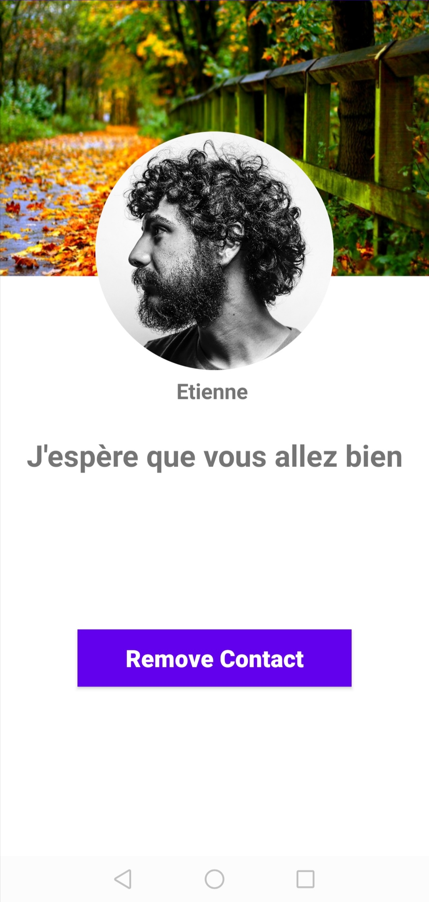
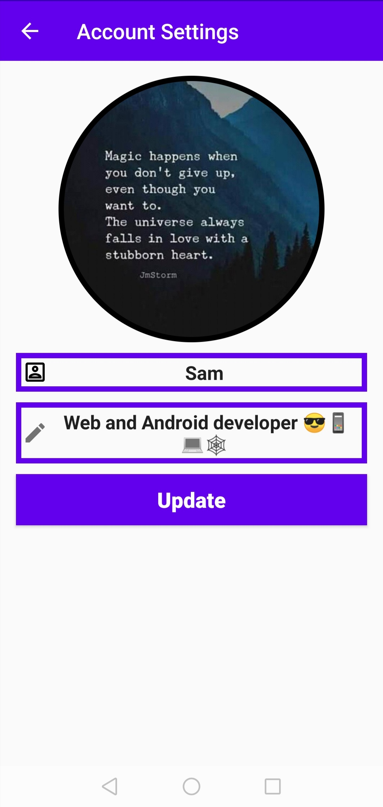
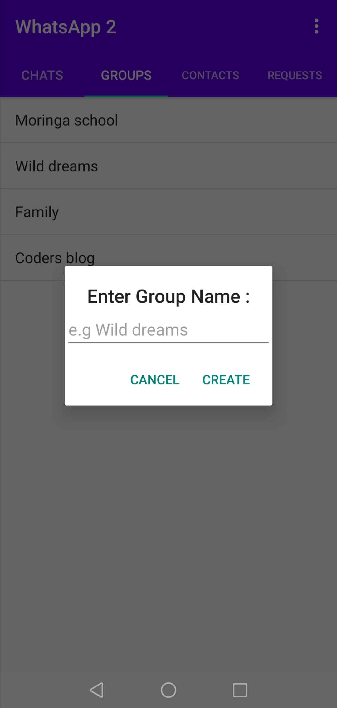

# PROJECT NAME. :phone::envelope::black_nib::performing_arts:
The project is titled 'WhatsApp 2'. The project basically functions as the title suggests.If you want to see more, you can view the live demo [here](https://appetize.io/app/uv9p412bztdu631cmwzx6fkzqg?device=nexus5&scale=75&orientation=portrait&osVersion=8.1).:paw_prints::paw_prints:

## AUTHOR NAME.
My name is Samuel and i am currently a learning software programmer at Moringa School.:man_technologist::man_technologist:

## DESCRIPTION OF PROJECT.
The project is a Java Android-platform based chat application that is a near replica of the popular WhatsApp application. The app is maintains the base minimum functionalities of WhatsApp such as a group chat, individual chat, ability to send, receive and delete messages and documents such as PDF, image and MS word files.
One can also view the status of his/her contacts in the contacts section such as being online or offline.
The app has even been tweaked a bit with a Find Friends Section where one is able to find other people using the same app.:medal_military::medal_military::trophy:
 

   
    
   
   
   
    
   
   
    
   
   
   
   
 

### PROJECT SETUP INSTRUCTIONS.
1. Fork this repository.
2. Clone this repository onto your local machine through use of the command `git clone <Forked-repository-link.>`. 
3. Navigate to your terminal.
4. Navigate the the appropriate directory by use of cd command `cd<root-folder>`.
5. In order to make any additional changes to the project, it is highly advised that you install Android Studio, the official IDE for Android.(Integrated Development Environment).
                                                                                                                                                                                                                                                                                                                                                                                                                                                                                                                                                                                                                                                                                                                                                                                                                                                                                                                                                                                                                                                                                                                                                                                                                                                                                                                                                                                                                                                                                                                                                                                                                                                                                                                                                   
## TECHNOLOGIES USED.
#### Main Requirements::signal_strength::high_brightness:
- Java- The main programming language used.
- Gradle - The main build automation tool used.
- JUnit - The main testing library used.
- [Android Studio](https://developer.android.com/studio) - The official IDE for creation of android apps.
#### Libraries used::card_index_dividers:
- [Picasso](https://square.github.io/picasso/) - A powerful image downloading and caching library for Android.
- [Butterknife](https://github.com/JakeWharton/butterknife) - Binds Android views and callbacks to fields and methods.
- [Google Android Material](https://material.io/develop/android/docs/getting-started/) - Provides material components for Android.
- [CircleImageView](https://github.com/hdodenhof/CircleImageView) - A circular ImageView for Android.
- [Android-Image-Cropper](https://github.com/ArthurHub/Android-Image-Cropper) - Image Cropping Library for Android, optimized for Camera/Gallery.

#### Firebase
An entire package by itself, the following libraries were used:
- [Firebase Storage](https://firebase.google.com/docs/storage/?gclid=EAIaIQobChMIjKibzJyu6gIVhtKyCh3-hgIhEAAYASAAEgKvrPD_BwE) - Cloud storage is built for app developers who need to store and serve user-generated content, such as photos and videos.
- [Firebase Authentication](https://firebase.google.com/docs/auth) - Provides backend services, easy-to-use SDK's and ready-made UI libraries to authenticate users to your app.
- [Firebase RealTime Database](https://firebase.google.com/docs/database) - Store and sync data with a NoSQL cloud database.
- [Firebase Cloud Messaging](https://firebase.google.com/docs/cloud-messaging) - A cross-platform messaging solution that lets you reliably send messages at no cost.

### KNOWN BUGS.:warning:
* Some profile images do not display.
* Small issue when opening PDF files.
* Small issue logging in with a phone number.

### CONTACT INFORMATION.
For more information, feel free to contact me through the email address: successam336@gmail.com

### LICENCE AND COPYRIGHT INFORMATION.
Copyright :copyright: 2020-present

Permission is hereby granted, free of charge, to any person obtaining a copy
of this software and associated documentation files (the "Software"), to deal
in the Software without restriction, including without limitation the rights
to use, copy, modify, merge, publish, distribute, sublicense, and/or sell
copies of the Software, and to permit persons to whom the Software is
furnished to do so, subject to the following conditions:

The above copyright notice and this permission notice shall be included in all
copies or substantial portions of the Software.

THE SOFTWARE IS PROVIDED "AS IS", WITHOUT WARRANTY OF ANY KIND, EXPRESS OR
IMPLIED, INCLUDING BUT NOT LIMITED TO THE WARRANTIES OF MERCHANTABILITY,
FITNESS FOR A PARTICULAR PURPOSE AND NONINFRINGEMENT. IN NO EVENT SHALL THE
AUTHORS OR COPYRIGHT HOLDERS BE LIABLE FOR ANY CLAIM, DAMAGES OR OTHER
LIABILITY, WHETHER IN AN ACTION OF CONTRACT, TORT OR OTHERWISE, ARISING FROM,
OUT OF OR IN CONNECTION WITH THE SOFTWARE OR THE USE OR OTHER DEALINGS IN THE
SOFTWARE.
